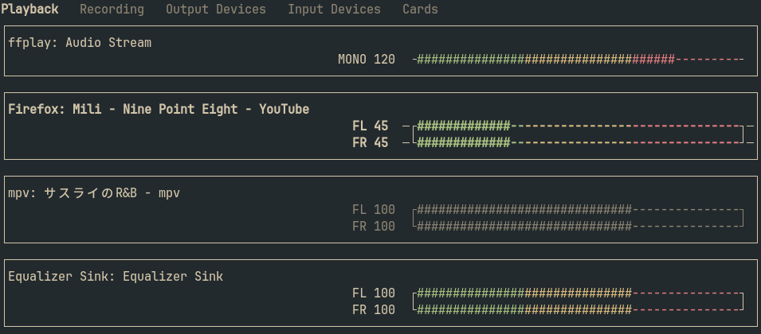

# pipemixer
This is a TUI volume control application for [pipewire] built with [ncurses].
Heavily inspired by [pulsemixer] and [pwvucontrol].



## Building
```
git clone https://github.com/heather7283/pipemixer
cd pipemixer
meson setup build
meson compile -C build
```

## Running
```
pipemixer -h
```
To debug:
```
pipemixer -l debug -L 4 4>pipemixer.log
```
With valgrind:
```
valgrind --leak-check=full --show-leak-kinds=all --track-fds=yes --log-fd=5 -- pipemixer -l debug -L 4 4>pipemixer.log 5>valgrind.log
```

## Config
pipemixer reads its config from $XDG_CONFIG_HOME/pipemixer/pipemixer.ini.
See [example config](pipemixer.ini) and pipemixer.ini(5) for details.

## TODOs
- [x] Make keybinds configurable
- [ ] Make colors configurable? (Using colors in ncurses is torture so not sure)
- [x] Write a man page for config

## References
- https://docs.pipewire.org
- https://gitlab.freedesktop.org/pipewire/pipewire/-/blob/master/src/tools
- https://github.com/saivert/pwvucontrol
- https://github.com/quickshell-mirror/quickshell/tree/master/src/services/pipewire
- https://invisible-island.net/ncurses
- https://tldp.org/HOWTO/NCURSES-Programming-HOWTO

[pipewire]: https://pipewire.org/
[pulsemixer]: https://github.com/GeorgeFilipkin/pulsemixer
[pwvucontrol]: https://github.com/saivert/pwvucontrol
[ncurses]: https://invisible-island.net/ncurses
